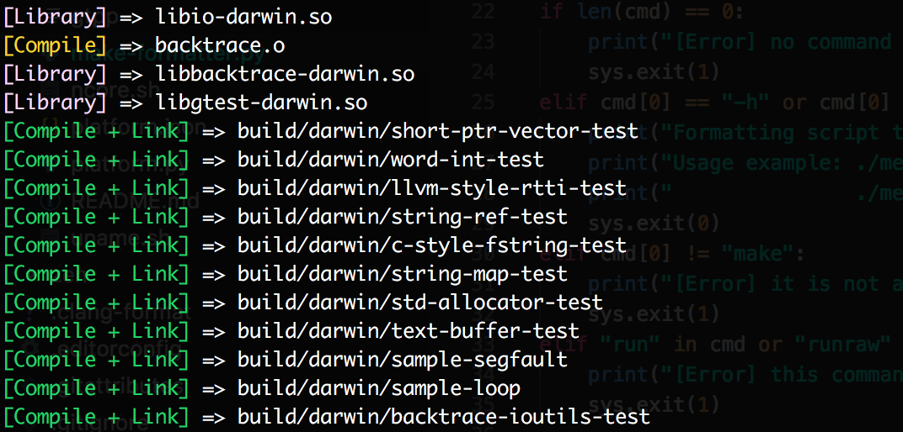
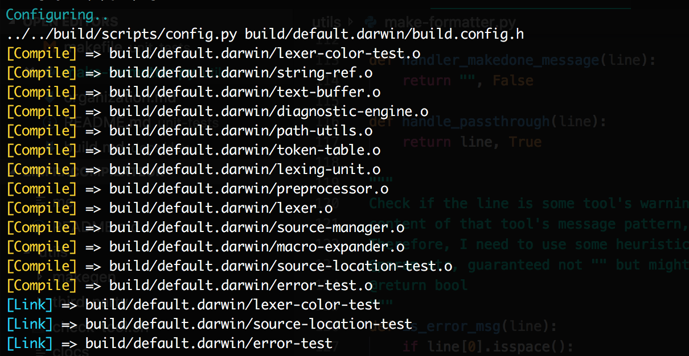

# Let Make's output be succinct!

e.g. 
```
make-formatter.py make -j8
```
(you could have a shorter alias for this script)




Works with Python2 (tested with 2.7.14) and Python3 (tested with 3.5.2) on macOS/Linux.<br />
Feel free to modify. BSD License.

###### EOF
